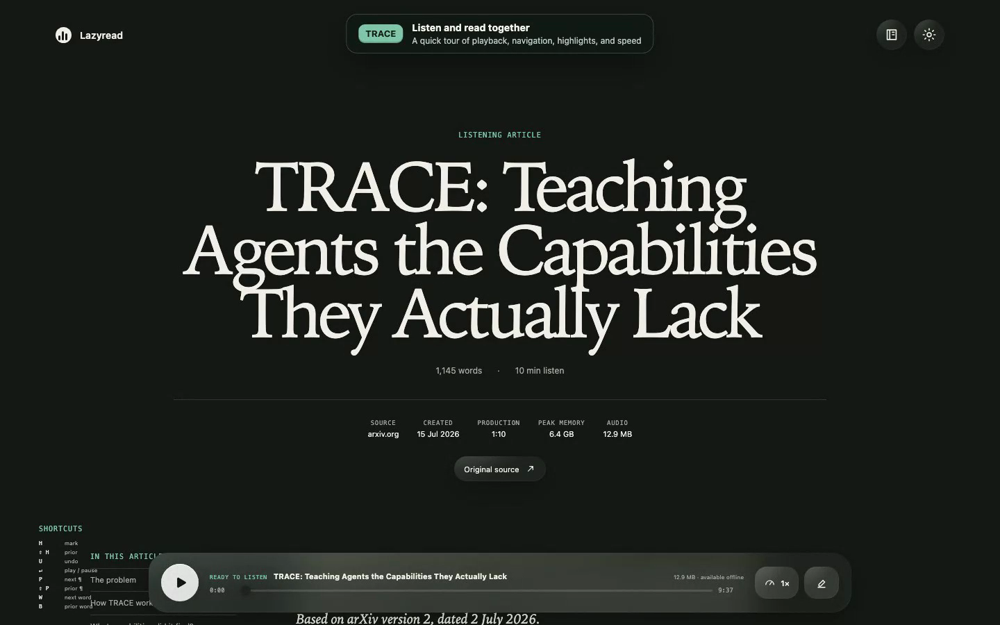

# Lazyread

Turn a URL or Markdown file into a private listening article with natural local
speech, synchronized word highlighting, auto-scroll, and saved highlights.

[](docs/media/lazyread-trace-walkthrough.mp4)

[Watch the 46-second walkthrough](docs/media/lazyread-trace-walkthrough.mp4).

## Install

Lazyread currently supports Apple Silicon Macs running macOS 14 or newer. It
also needs Node.js 20.19+, FFmpeg 6+, and [UV](https://docs.astral.sh/uv/).

Install the Lazyread skill in Codex, Claude Code, or another compatible agent:

```sh
npx skills add https://github.com/jayfarei/lazyread/
```

Restart your agent, then invoke the skill with a URL or Markdown file:

```text
$lazyread https://example.com/article
```

On first use, Lazyread explains the local setup and asks before downloading
about 5.4 GB of speech and alignment models. The skill then creates the article,
waits for narration, verifies the reader, and returns a reusable local URL.

## What you get

- Natural speech generated locally on your Mac
- Word-by-word tracking and automatic scrolling
- Keyboard navigation, playback speed, and sentence highlights
- A durable private library at `http://127.0.0.1:4242/library`
- Optional private access through your Tailscale network

Article content, audio, highlights, and models remain on your Mac. Creating an
article from a URL still accesses the original website for extraction.

The runtime is also published on [PyPI](https://pypi.org/project/lazyread/).
For development and release details, see [`design/`](design/INDEX.md) and
[`RELEASING.md`](RELEASING.md).

## License

MIT. See [`THIRD_PARTY_NOTICES.md`](THIRD_PARTY_NOTICES.md).
